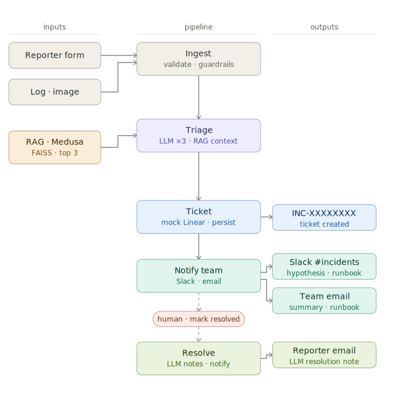

# SRE Incident Intake & Triage Agent

Automated incident triage for e-commerce platforms powered by a multimodal LLM, RAG over the Medusa codebase, and end-to-end observability.

Built for **AgentX Hackathon 2026**.

---

## What it does

When an engineer submits an incident report, the agent automatically:

1. **Triages** the incident using a multimodal LLM (Qwen3.5 0.8B Q4_K_M) — assigns severity P1–P4, identifies the affected component, generates a root-cause hypothesis, and produces a 3–5 step actionable runbook
2. **Creates a ticket** in a Linear-style ticket store with full triage metadata
3. **Notifies the team** via email and Slack with the hypothesis, technical summary, and runbook — everything the on-call engineer needs at 2am without opening another tool
4. **Notifies the reporter** when the ticket is resolved, with an LLM-generated resolution note

---

## Architecture



Full architecture and orchestration details: [`AGENTS_USE.md`](./AGENTS_USE.md)  
Scaling analysis: [`SCALING.md`](./SCALING.md)

---

## Tech stack

| Layer | Technology                                         |
|-------|----------------------------------------------------|
| API | FastAPI + Uvicorn                                  |
| LLM (local) | Qwen3.5-0.8B-Q4_K_M via llama-cpp-python           |
| LLM (cloud) | OpenRouter (Qwen/Qwen3.5-0.8B)             |
| Multimodal | Qwen3.5ChatHandler + mmproj                        |
| RAG | FAISS + sentence-transformers, indexed over Medusa |
| Tracing | Langfuse                                           |
| Notifications | smtplib (email) + Slack Incoming Webhooks          |
| Ticket store | In-memory + JSON file persistence (mock Linear)    |
| Container | Docker Compose                                     |

---

## Quick start

See [`QUICKGUIDE.md`](./QUICKGUIDE.md) for the full step-by-step.

```bash
git clone <repo-url>
cd sre-agent
cp .env.example .env
# Fill in OPENROUTER_API_KEY and SLACK_WEBHOOK_URL in .env
docker compose up --build
```

Open [http://localhost:8000](http://localhost:8000)

---

## Key endpoints

| Method | Path | Description |
|--------|------|-------------|
| `GET` | `/` | Web UI |
| `POST` | `/report` | Submit incident (multimodal) |
| `POST` | `/resolve/{id}` | Resolve ticket + notify reporter |
| `GET` | `/tickets` | List tickets (filter, search, paginate) |
| `GET` | `/tickets/{id}` | Get single ticket |
| `GET` | `/metrics` | Observability counters |
| `GET` | `/notifications` | Notification log |
| `GET` | `/docs` | Interactive API docs (Swagger) |

---

## E-commerce codebase

RAG is indexed over **[Medusa](https://github.com/medusajs/medusa)** — an open-source Node.js e-commerce framework. The agent uses relevant code chunks as secondary context during triage to ground hypotheses in actual implementation details.

---

## Project structure

```
├── api/
│   └── main.py               # FastAPI app + HTML UI
├── agent/
│   ├── inference.py          # LLM backends (local / OpenRouter / mock)
│   ├── pipeline.py           # 5-stage orchestration
│   ├── guardrails.py         # Input sanitization
│   ├── indexer.py            # FAISS RAG index
│   └── notifier.py           # Email + Slack
├── ticketing/
│   └── mock_linear.py        # Ticket store
├── observability/
│   ├── logger.py             # Structured logging + metrics
│   └── tracing.py            # Langfuse integration
├── data/                     # Runtime: tickets.json, notifications.jsonl
├── models/                   # GGUF model files (not committed)
├── docker-compose.yml
├── .env.example
├── AGENTS_USE.md
├── SCALING.md
└── QUICKGUIDE.md
```

---

## License

MIT — see [`LICENSE`](./LICENSE)
